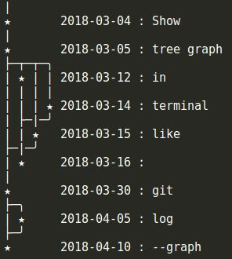

# ASCIITreeLog

Show tree graph in terminal like "git log --graph" with time series.



## Installing

```
    $ git clone https://github.com/mhlemonh/ASCIITreeLog.git
    $ cd ASCIITreeLog
    $ pip install . 
```
## Example

```python
    # -*- coding: utf-8 -*-
    from ASCIITreeLog import TreeNode, show_tree
    from datetime import datetime


    node_show = TreeNode('Show', datetime(2018,3,4))
    node_tree_graph = TreeNode('tree graph', datetime(2018,3,5))
    node_show.add_downstream(node_tree_graph)

    node_git = TreeNode('git', datetime(2018,3,30))
    node_tree_graph.add_downstream(node_git)

    node_graph = TreeNode('--graph', datetime(2018,4,10))
    node_git.add_downstream(node_graph)

    node_in = TreeNode('in', datetime(2018,3,12))
    node_in.set_upstream(node_tree_graph)

    node_like = TreeNode('like', datetime(2018,3,15))
    node_like.set_upstream(node_tree_graph)
    node_like.add_downstream(node_git)

    node_terminal = TreeNode('terminal', datetime(2018,3,14))
    node_terminal.set_upstream(node_tree_graph)
    # node_terminal.set_upstream(node_in)

    node_empty = TreeNode('  ', datetime(2018,3,16))
    node_empty.set_upstream(node_terminal)
    node_empty.set_upstream(node_in)

    node_log = TreeNode('log', datetime(2018,4,5))
    node_log.add_downstream(node_graph)
    node_git.add_downstream(node_log)


    print show_tree(node_show, node_chr="★")
```
